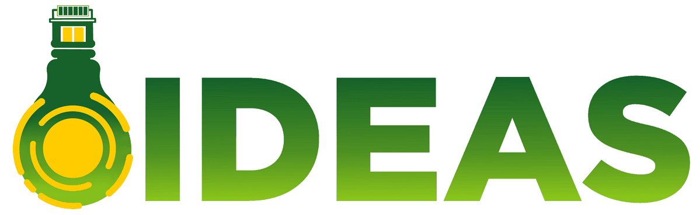

<header>
<h1>IDEAS H2020 </h1>

Novel building Integration Designs for increased Efficiencies in Advanced Climatically Tunable Renewable Energy Systems

</header>

##Project Summary
Buildings play a significant role in the global energy balance. Typically, they account for 20-30% of the total primary energy requirement of industrialized countries, 40% in EU. Applying the proposed integrated RES to buildings is an important application for wider integration and deployment of renewable energy and to achieving our binding EU targets of at least a 40% reduction in greenhouse gas emissions (GHG) by 2030, compared to 1990 and at least 27% of renewable energy in EU. The IDEAS project will create an innovative building integrated renewable energy system (RES) which will cost effectively exceed current RES efficiencies, generating electricity, heat and cooling and optimised for multifamily, public and commercial buildings in different climatic conditions. The research aim is to create a novel low-cost building integrated RES maximizing the output tuneable for different climatic conditions through novel luminescent and geometric concentrator techniques leading to current solar system efficiencies being exceeded electrically. Thermally enhancement will be achieved using enhanced organic phase change materials (PCM) with a passive biomimetic heat transfer mechanism for heat storage and discharge. An electrically driven multi-source heat pumpHP system will then use the main energy sources at building scale (waste heat from the system, air and ground), to provide the input to an integrated underfloor heating and hot water system, and to manage the thermal energy storage. This building integrated RES will use advanced control techniques to maximize performance and electrical and thermal/cooling self-sufficiency in the building. The technology will be optimized and demonstrated for use in multi-family residential buildings, commercial and public buildings.

##Our Role
We will be responsible for building two energy efficienty estimation toolkits: one designed for end-users and one for 
professionals in WP6.

##Further information
The project has been funded by [the European Commission](https://cordis.europa.eu/project/id/815271) (g.n. 815271) started in 
May 2019 and it will finish in April 2022. 
