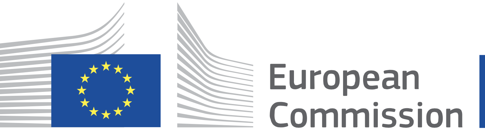

<header>
<h1> </h1>

Novel building Integration Designs for increased Efficiencies in Advanced Climatically Tunable Renewable Energy Systems

</header>

One of the most difficult challenges for opening the XR experiences for all is supporting the creation and editing for end-users, even though limited and simplified approaches. This can boost the adoption of such a medium by new market segments and create new business opportunities. While shifting the entire building process towards end-users is not entirely feasible, it’s possible to configure the environments through scene builders or inspectors, which allow placing and orienting 3D models that constitute the virtual word in both immersive or desktop mode. So it’s relatively easy for end-users to get objects from a model repository and to create a static virtual world.  What is currently difficult for them is the definition of the object behaviour i.e., responding to the interaction with the user or with other objects.
The main goal of ECARules4ALL is the definition of a Unity plugin for enabling end-users without programming experience to modify the behaviour of an XR experience through event-condition action rules, defined in natural language. We propose the rule-editing End-User Development (EUD) technique for solving this problem, which consists of defining the object behaviour through  Event-Condition-Action rules expressed in natural language. The rules will define the behaviour of each virtual object in the environment in isolation and its interaction with other objects. Once equipped with components supporting the runtime specification of behaviour rules, XR environments will offer a high degree of customization to end-users. We foresee the opportunity for them to pick existing environments and tailor them for their communication purposes, as currently happens with website templates. 

##Further information
The project has been funded by the second open call in the [XR4All H2020 project](https://xr4all.eu) and started in October 2020. 
